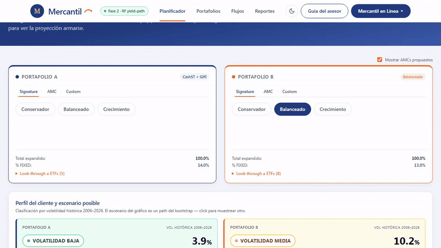
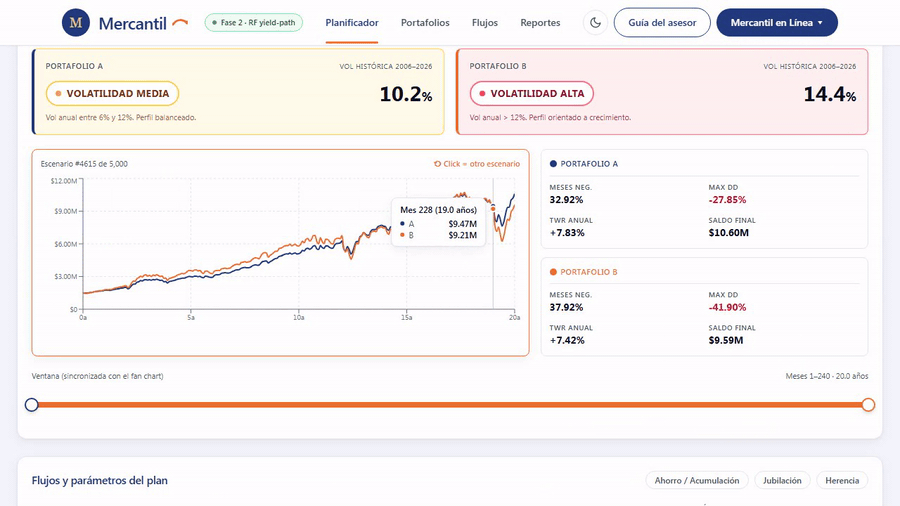
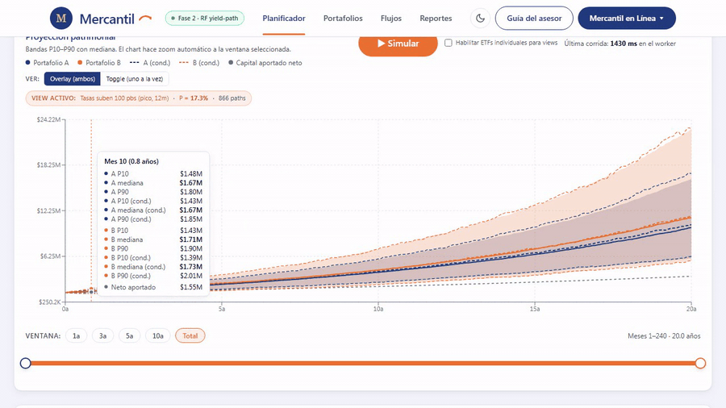
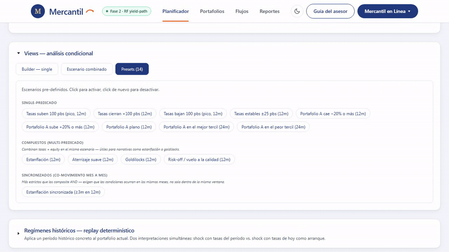
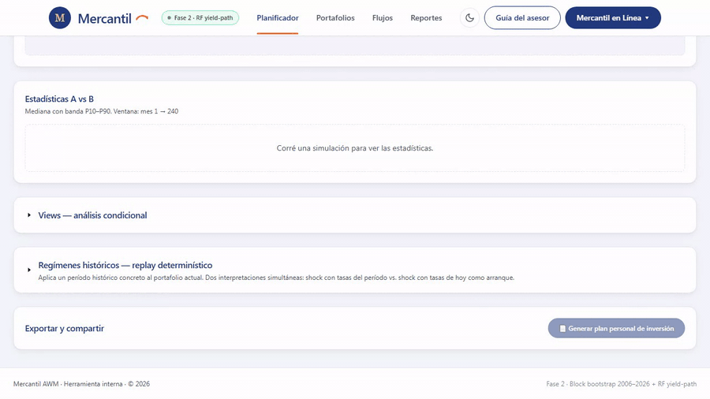

# Parte 2 — Mapa de la herramienta

Recorrido por la pantalla del Planificador Patrimonial, zona por zona. El objetivo de esta parte es que el asesor sepa **dónde está cada control** sin tener que descubrirlo en vivo frente al cliente. La parte 3 cubre cómo usarlos en orden; ésta sólo los ubica.

---

## Vista general — el flujo natural arriba-abajo

La pantalla está diseñada para leerse de arriba hacia abajo en el orden de uso natural. Configurás los portafolios primero, después el plan de flujos, después corrés la simulación, leés los resultados, activás views si la conversación lo pide, y finalmente exportás. Cada zona tiene un propósito específico.

*Panorámica decorativa de la herramienta. Las zonas siguientes de esta parte cubren cada bloque en detalle, con texto legible y encuadre tight.*

---

## Zona 1 — Header

Contiene la marca Mercantil AWM (M dorada + nombre), un badge verde con la fase de motor activa (*"Fase 2 · RF yield-path"* al cierre del 2026-05-06), y el toggle de tema claro/oscuro (sol/luna) en el extremo derecho. El badge sirve de referencia rápida para reportar bugs: si el cliente o el asesor reportan algo raro, anotar la fase del motor activa en el momento.

El toggle de tema cambia toda la paleta — útil cuando se proyecta en pantalla a un cliente con baja luz ambiente. La preferencia se persiste localmente por navegador.

*Modo claro. La versión en modo oscuro queda pendiente como asset adicional para mostrar la paleta navy-tinted.*

---

## Zona 2 — Selector de portafolios A y B

Dos columnas idénticas, una por portafolio. Cada columna tiene tres pestañas:

- **Signature** — las tres carteras institucionales estándar de Mercantil: Conservador, Balanceado, Crecimiento. Es la receta pre-definida por perfil.
- **AMC** — los bloques individuales que componen las signatures. Útil cuando el cliente requiere exposición a un solo segmento (por ejemplo, USA.Eq para S&P puro, o GlFI para renta fija global). El selector incluye un optgroup *"Existentes"* con los siete AMCs aprobados; si el toggle global *"Mostrar AMCs propuestos"* está activo, aparece también el optgroup *"Propuestos"* (CashST, USGrTech, USTDur).
- **Custom mix** — sliders sobre los AMCs visibles para definir un mix a medida. Suma 100% obligatoria; el botón *"Normalizar a 100%"* redistribuye proporcionalmente los pesos hasta cuadrar.

Debajo del selector, un donut colapsable muestra el **look-through a ETFs** del portafolio activo y el **% FIXED** total (FIXED6 + FIXED9). Útil para mostrar al cliente *"esto es lo que su portafolio realmente compra a nivel ETF"* sin tener que abrir la composición a mano.

### Toggle global "Mostrar AMCs propuestos"

Por encima de las dos columnas A y B. Default desactivado — los AMCs propuestos no están aprobados todavía y no deberían seleccionarse accidentalmente. Al destildar el toggle se aplica un fallback automático: si algún portafolio quedaba apuntando a un AMC propuesto, vuelve a `GlFI` (signature/amc) o renormaliza el resto a 100% (custom). Es destructivo — al re-tildar, los pesos anteriores no se restauran.

---

## Zona 3 — Perfil de volatilidad y sample path

El card *ProfilePreview* tiene tres elementos:

- **Badges de perfil** — clasificación automática del portafolio por volatilidad histórica anualizada: Baja (< 6%), Media (6-12%), Alta (> 12%). Verde, ámbar, rosa respectivamente. Disponibles antes de simular — útiles para anclar la conversación con el cliente desde el primer minuto: *"este portafolio entra en categoría Media — volatilidad esperada del 9% anual"*.
- **Mini chart con sample path** — una sola trayectoria aleatoria del bootstrap, pareada A/B (mismo "mercado" para los dos). **Click en el gráfico = nuevo path**. Es la herramienta más concreta para mostrar al cliente *"así puede verse un futuro posible — cliquee para ver otro"*.
- **KPIs del path activo** — % meses negativos, max drawdown, TWR anualizado, saldo final. Calculados sobre la ventana seleccionada. Cambian al cliquear un nuevo path.

Debajo, un **slider de ventana** dual-thumb sincronizado con el del FanChart. Mover uno mueve el otro automáticamente. Útil para mostrar cómo cambia la lectura del perfil a 1 año vs 5 vs total.

---

## Zona 4 — Editor de flujos

Tres preset-chips arriba: **Ahorro acumulación**, **Jubilación**, **Herencia**. Click aplica una receta de reglas típicas que después se puede ajustar. Debajo, la lista editable de reglas activas — cada una con: signo (depósito/retiro), monto, frecuencia (mensual/trimestral/semestral/anual), mes de inicio, mes de fin (o *sin fecha fin* hasta horizonte), crecimiento anual del monto (default 0%).

Botones por regla: editar inline, duplicar, eliminar. Validación inline (no aparecen alerts molestos): si la regla no es válida, el campo afectado se enmarca en rojo.

Por encima de la lista, los parámetros del plan global: capital inicial, horizonte (1-360 meses), modo (nominal o real), inflación anual (default 2,5% — sólo aplica en modo real).

> **Modo nominal vs real — pedagogía rápida para el cliente**: en modo nominal, los montos son los dólares efectivos que entran y salen. En modo real, se interpretan como dólares de hoy y se inflan automáticamente para mantener poder adquisitivo. Para planes de retiro a 25-30 años, el modo real es casi siempre el correcto — un retiro mensual de USD 4.000 nominales es muy distinto a USD 4.000 reales en el año 25.

---

## Zona 5 — Fan chart y simular

El gráfico principal. Eje X: meses → años. Eje Y: valor en USD. Dos bandas se superponen: A en navy con 20% de opacidad, B en naranja con 20% — el color codifica la pertenencia al portafolio.

Cada portafolio rinde dos líneas (P50 mediana) y dos bandas (P10/P90). Una línea gris dashed marca el capital aportado neto, determinístico. Tooltip al hover muestra A y B para los tres percentiles más el capital aportado en el mes consultado.

### El RangeSlider de ventana

Dual-thumb arrastrable, con chips de salto rápido: *1a / 3a / 5a / 10a / Total*. **El chart siempre se zoomea automáticamente a la ventana seleccionada** — no existe vista completa del horizonte. Toda la vista ES la ventana. Mover los thumbs recalcula stats y perfil en menos de 100 ms.

Atajos de teclado cuando el slider tiene foco: flecha izquierda/derecha mueve un mes, Shift + flecha mueve un año, Home/End van a los extremos.

### Botón Simular

Top-right del card, embebido en el header del fan chart. Al hacer click, el botón cambia a *"Simulando paths: N/5000"* con barra de progreso naranja en vivo. Al terminar muestra el tiempo transcurrido en ms — 1 a 3 segundos en una laptop moderna para 5000 × 360.

### Visualización condicional (cuando un view está activo)

Aparece un switch en el header del fan chart con dos modos:

- **Toggle** (default) — bandas de base 20% fill + medianas sólidas. Al activar el view, **se reemplazan** por las bandas/medianas condicionales con la misma estética. Switch entre uno y otro — nunca ambos visibles.
- **Overlay** — bandas de base sólidas + medianas sólidas, y encima 6 líneas dashed con los percentiles condicionales (P10/P50/P90 para A y B). Ambos conjuntos visibles a la vez. Leyenda extendida.

El eje Y es estable bajo todos los toggles para evitar saltos visuales que confunden al cliente. Sólo se recalcula al mover el slider de ventana.

---

## Zona 6 — Panel de stats

Tabla A vs B vs Δ (B − A). Una fila por métrica de las nueve documentadas en la Parte 4. Cada celda muestra mediana acompañada de los percentiles P10 y P90 entre paréntesis cuando aplica (todas las métricas paths-based).

La columna Δ está coloreada: verde si B mejora respecto a A (mayor rentabilidad, menor drawdown, menor probabilidad de ruina), rojo si B empeora. Hace que la conversación de comparación sea visual — el asesor lee los verdes y rojos sin tener que calcular signos.

Debajo de la tabla de las nueve métricas, dos números fijos que **no dependen de la ventana**: probabilidad de ruina y probabilidad de shortfall. Son globales al horizonte completo del plan, así que se mantienen estables aunque el slider de ventana se mueva.

---

## Zona 7 — Panel de views

El **ViewsPanel** vive debajo del panel de stats. Tiene tres tabs:

- **Presets** — los views built-in. Diez presets organizados en tres grupos: cuatro sobre tasas, cinco sobre el comportamiento del portafolio, y uno **synchronized** (estanflación SPY↓ Y TNX↑ ≥3m sincronizados en 12m). Click en un preset = activación inmediata.
- **Single view** — builder dinámico para construir un view custom de un solo predicado. Sujeto: portfolioReturn / yield / etfReturn. Dirección, threshold, ventana — configurable.
- **Escenario combinado** — builder dinámico para views compuestos: 2 a 4 sub-componentes con combinator AND, OR o **Sincronizado (mes a mes)**. Cada sub-componente tiene su propia ventana y threshold.

Cuando un view está activo, se muestra debajo el **análisis asimétrico**: probabilidad empírica del view, número de paths matched (`nMatched`), y métricas condicionales para A y B en formato base / matched / unmatched.

> **Regla práctica de confiabilidad**: si nMatched < 50, la herramienta no muestra métricas condicionales (sólo la probabilidad). Entre 50 y 500, las muestra con bandera *"muestra pequeña"*. Por encima de 500, lectura directa.

---

## Zona 8 — Panel de regímenes históricos

Debajo del ViewsPanel. Tres regímenes históricos pre-definidos: **Crisis 2008** (oct-2007 → mar-2009), **COVID 2020** (feb → dic), **Inflación 2022** (ene → oct). Para cada uno, dos interpretaciones simultáneas:

- **"Tasas actuales"** — replay del régimen aplicando los movimientos de tasas históricos sobre el nivel de tasas vigente hoy. Se aplica sólo a tickers de renta fija. Muestra cómo respondería el portafolio si ese régimen ocurriera ahora.
- **"Tasas del período"** — replay 100% histórico, incluyendo el carry y el nivel de tasas de la época. Muestra cómo respondió en su momento un portafolio idéntico al de hoy.

Ambas interpretaciones aparecen lado a lado, no se alternan. Es uno de los diferenciadores de la herramienta sobre la industria: la mayoría de las plataformas top-tier muestran replay 100% histórico sin re-proyección al régimen actual.

---

## Zona 9 — Exportar y compartir

Cuatro botones, en este orden visual:

1. **📄 Generar plan personal de inversión** — abre el modal del PDF de cierre. **Bloqueado con tooltip** *"Ejecute primero una simulación"* mientras no haya simulación corrida. Es el botón "primario" del cluster — el que entrega el documento al cliente.
2. **📊 Excel (.xlsx)** — exporta un workbook con cuatro hojas: Config (portafolios + plan + bootstrap + métricas en la ventana), Reglas (todas las FlowRule), Stats (resumen tabular igual al panel), Paths (primeras 500 trayectorias × horizonte, A y B). Para asesores que quieren cruzar números con su propio modelo o entregar el detalle a otro analista.
3. **📋 Copiar config** — copia al clipboard un JSON con portafolios A, B, plan y bootstrap. Útil para compartir entre asesores la configuración exacta de un caso por chat o mail, sin tener que adjuntar archivos.
4. **Pegar config JSON** — el inverso del anterior. Pega un JSON copiado por otro asesor y reconstruye exactamente la sesión.

### Modal "Generar plan personal de inversión"

Al hacer click en el botón, se abre un modal con el siguiente form:

- **Cliente** — nombre completo. Texto libre, requerido.
- **Asesor** — nombre del asesor. Texto libre, requerido.
- **Marco Wealth Way** — radio entre Liquidez (necesidades 0-5 años), Longevidad (sostenibilidad de largo plazo), Legado (multi-generacional). Un PDF cubre **un solo bucket**: si el cliente tiene varios objetivos, se generan PDFs separados con naming `cliente-bucket.pdf`.
- **Versión** — Completa (18-25 pp) o Ejecutiva (6-8 pp). Mismo state JSON, distinto nivel de detalle.
- **Idioma** — ES / EN / FR / DE. FR y DE marcados con ⚠ porque están en versión borrador hasta revisión por hablante nativo. El PDF lleva un banner visible cuando se genera en idioma borrador.
- **Secciones modulares** — checkboxes para activar/desactivar las secciones F (stress tests por régimen), G (sensibilidades), K (metodología). El resto de las secciones siempre se incluyen.
- **Carta personalizada del asesor** — textarea opcional, hasta 600 caracteres. Aparece en la portada del PDF (sección A2) como mensaje breve al cliente.

Al hacer click en *Generar PDF*, la herramienta renderiza el documento client-side, embebe el state JSON en la metadata, y dispara la descarga con naming `cliente-bucket[-ejec].pdf`. El proceso toma 2 a 5 segundos.

> **El PDF contiene el estado completo embebido**. En sesiones futuras, importar el PDF (drag-and-drop sobre la herramienta — feature en desarrollo) rehidrata todo el plan: portafolios, reglas, ventana, parámetros del bootstrap. Es la forma de retomar exactamente la sesión cerrada.

---

## Resumen visual del flujo

> Header → Selector A│B → Perfil + sample → Flujos → Simular → Stats → Views → Regímenes → Exportar.

La parte 3 cubre cómo ejecutar este flujo en cada reunión.

---

## Lista de assets pendientes para esta parte

| ID | Tipo | Descripción | Notas para grabar |
|---|---|---|---|
| 2.1 | SCREENSHOT | Vista completa de la herramienta a 1280×800 | Caso sample USD 1.500.000 / 240 m / Balanceado vs Crecimiento ya simulado. Modo claro. |
| 2.2 | SCREENSHOT | Header con foco en badge verde de fase del motor | Modo claro y oscuro lado a lado. |
| 2.3 | GIF (8 s) | Toggle "Mostrar AMCs propuestos" + autofallback | CashST 30% + GlFI 70% → destildar → ver salto a GlFI 100%. |
| 2.4 | GIF (6 s) | Click-to-resample del sample path en ProfilePreview | 4 clicks consecutivos. Resaltar que badges no cambian. |
| 2.5 | SCREENSHOT | Editor de flujos con regla de Pablo cargada | Regla resaltada + parámetros del plan global visibles. |
| 2.6 | GIF (12 s) | Toggle/Overlay del fan chart con view activo | Activar preset Tasas +100 pbs (pico, 12m) → alternar 3 veces. |
| 2.7 | SCREENSHOT | Panel de stats en caso Pablo | Δ verde/rojo claramente visible. |
| 2.8 | GIF (10 s) | Activación del preset Estanflación sincronizada | Resaltar la probabilidad ~1-3% y el nMatched. |
| 2.9 | SCREENSHOT | Panel de regímenes con los 3 bloques abiertos | Contraste lado-a-lado de las 2 interpretaciones. |
| 2.10 | GIF (12 s) | Flujo botón "Generar plan personal de inversión" | Bloqueado → simular → click → modal abierto → cerrar sin generar. |

Todos los GIFs en formato MP4 o GIF optimizado a < 2 MB cada uno. ScreenToGif (https://www.screentogif.com) es la herramienta sugerida en el README del instructivo.
