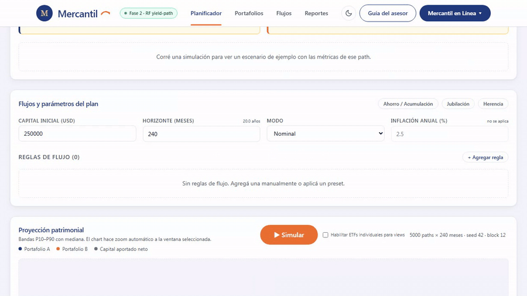
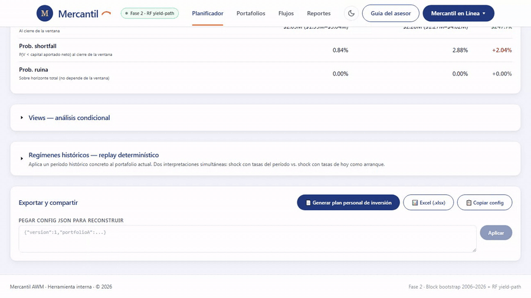

# Parte 3 — Los cuatro pasos operativos

Cada reunión con cliente sigue el mismo flujo: **configurar, simular, conversar, cerrar**. Esta parte cubre los cuatro pasos en orden, con los detalles que se aprenden con las primeras quince reuniones y que vale la pena tener documentados desde el principio.

> **Tiempo objetivo de la primera reunión**: 60-75 minutos en total — 15 para configurar el plan, 5 para simular y leer resultados, 30-40 para conversar (views, regímenes, decisiones), 5-10 para generar el entregable. Las reuniones de seguimiento son más cortas (30-45 min) porque parte de la configuración ya viene del PDF previo.

---

## Paso 1 — Configurar

El asesor llega a la reunión con la herramienta abierta y un caso base mental. La configuración se construye en orden de arriba hacia abajo: primero los portafolios, después el plan.

### 1.1 Decidir si se compara A vs B o se trabaja con un solo portafolio

La herramienta siempre rinde dos portafolios en paralelo. Hay dos formas de aprovecharlo:

- **Comparativo A vs B clásico** — el patrón más frecuente. A = portafolio actual del cliente o la opción conservadora; B = la opción que se está considerando o la signature recomendada. La conversación gira en torno al delta entre ambos.
- **Mismo portafolio en A y B** — útil cuando se quiere mostrar al cliente sólo un portafolio (por ejemplo, una decisión ya tomada de antemano). Setear A = B y leer las stats de cualquiera de las dos columnas.

El patrón comparativo es lo que más valor entrega a la mayoría de los clientes. La parte 5 del instructivo desarrolla cuatro casos típicos y todos usan A vs B.

### 1.2 Elegir tipo de portafolio: Signature, AMC o Custom

Para cada portafolio, el asesor elige una de las tres pestañas:

- **Signature** cuando el perfil del cliente cae limpiamente en uno de los tres estándares de Mercantil (Conservador / Balanceado / Crecimiento). Es la opción default y la más fácil de explicar al cliente: *"este es el portafolio que Mercantil recomienda para perfil X"*.
- **AMC** cuando hay un objetivo muy específico que no calza con una signature. Ejemplos: USA.Eq para exposición pura a S&P 500; CashST para una posición de liquidez; GlFI para renta fija global como ancla.
- **Custom mix** cuando el cliente tiene una restricción que requiere una mezcla a medida — por ejemplo, *"50% en mi posición actual de RF + 50% en signature Crecimiento"*. Sliders sobre los AMCs visibles, suma 100% obligatoria. El botón *"Normalizar a 100%"* redistribuye proporcionalmente cuando los pesos no cuadran.

> **Recordatorio sobre AMCs propuestos**: el toggle global *"Mostrar AMCs propuestos"* expone tres bloques adicionales (CashST, USGrTech, USTDur) que **no están aprobados** todavía. El default es OFF. Sólo activarlo en sesiones internas de exploración, no en reuniones con clientes — el cliente no debería ver ni elegir un AMC propuesto.

### 1.3 Leer el perfil de volatilidad antes de simular

Apenas se elige un portafolio, el card *ProfilePreview* clasifica automáticamente la volatilidad esperada en Baja / Media / Alta. Esta lectura está disponible **antes de hacer click en Simular** porque depende sólo de la composición del portafolio, no de las trayectorias.

El sample path del card (un escenario aleatorio, click-to-resample) es la forma más concreta de mostrar al cliente *"así puede verse un futuro plausible — cliquee usted mismo para ver otros"*. En la práctica, esa interacción de 30 segundos hace más por el rapport que cinco minutos de explicación abstracta.

### 1.4 Configurar el plan de flujos

Tres pasos en este orden:

1. **Capital inicial y horizonte** — los dos parámetros básicos. Horizonte máximo: 360 meses (30 años). El slider de la UI los valida en vivo.
2. **Modo nominal vs real** — para planes a 15+ años, el modo real es casi siempre el correcto. Para planes a < 5 años, el modo nominal es más simple. La inflación default es 2,5% anual; ajustar si el cliente o la región tienen otra expectativa razonable.
3. **Reglas de flujo** — usar uno de los tres presets (Ahorro / Jubilación / Herencia) como punto de partida y editarlo, o construir las reglas desde cero. Cada regla tiene: signo (depósito/retiro), monto, frecuencia, mes de inicio, mes de fin opcional, crecimiento anual del monto.

> **Trampa frecuente**: en modo real, los retiros se interpretan como dólares de **hoy** y se inflan para mantener poder adquisitivo. Un retiro mensual de USD 4.000 en modo real a 25 años termina retirando alrededor de USD 7.400 nominales en el último mes. Si el cliente preguntó por *"USD 4.000 al mes"* asumiendo que era nominal, el plan está pidiendo más capital del que él pensó. Aclararlo siempre.

---

## Paso 2 — Simular

Una vez configurados los portafolios y los flujos, click en **Simular** (botón embebido en el header del fan chart, top-right). El motor corre 5000 trayectorias × horizonte y rinde el fan chart con bandas P10/P50/P90 + capital aportado neto, más el panel de stats con las nueve métricas en formato A vs B vs Δ.

Tiempo esperado: 1-3 segundos en una laptop moderna. La barra de progreso del botón muestra el avance en vivo (*"Simulando paths: N/5000"*) y al cierre reporta el tiempo en milisegundos. Si pasa de 10 segundos consistentemente, ver la parte 7 — Troubleshooting.

### Re-ejecución

Cuando cambian portafolios, seed, número de paths, block size, horizonte o tasas FIXED, hay que volver a hacer click en Simular — el motor corre de nuevo. **Cuando sólo cambian flujos o la ventana, NO hay que re-correr** — esos cambios son instantáneos sobre los paths ya en memoria.

Esto es importante para fluir en la reunión: el asesor puede explorar distintas combinaciones de aportes y retiros sin esperar 2 segundos cada vez. Sólo los cambios estructurales del portafolio o del bootstrap requieren re-correr.

### El RangeSlider de ventana

Una vez simulado, el slider dual-thumb debajo del fan chart permite recortar la ventana de lectura. Los chips *1a / 3a / 5a / 10a / Total* son saltos rápidos. Mover los thumbs recalcula el panel de stats y los KPIs del perfil en tiempo real (< 100 ms).

El uso típico durante la conversación: empezar mostrando *Total* (todo el horizonte), después zoom a los primeros 12 meses para mostrar el "peor año", después zoom a los últimos 5 años para mostrar la madurez del plan, etc.

### Lectura inicial del panel de stats

Al cierre del Paso 2, el asesor lee:

1. La **probabilidad de ruina** (si el plan tiene retiros) — el número que define si el plan es sostenible o no. Si supera la tolerancia acordada con el cliente (5-15% típicamente), parar y reconfigurar antes de seguir.
2. El **valor final mediano + banda P10/P90** del portafolio recomendado. Es el "número grande" de la conversación.
3. El **max drawdown** y el **peor rolling 12m** — para anticipar al cliente cuál es el peor momento que va a vivir en el camino.

Las nueve métricas en detalle viven en la Parte 4. La lectura inicial son esas tres-cuatro; el resto se va activando según la conversación lo pida.

---

## Paso 3 — Conversar

Es la parte más larga de la reunión y la que más valor agrega. La herramienta es el insumo cuantitativo; la conversación es el producto. Tres bloques típicos.

### 3.1 Lectura de las dos familias de indicadores

Si el cliente todavía no conoce la herramienta, el asesor hace un recorrido por las nueve métricas — Familia A (¿llega el plan a la meta?) y Familia B (¿cuánto cuesta el camino?). El detalle del recorrido vive en la Parte 4. Tiempo: 8-12 minutos.

Si el cliente ya conoce la herramienta de reuniones previas, este bloque se acorta a 2-3 minutos: leer rápido la diferencia entre A y B en las métricas más relevantes para el caso, y avanzar.

### 3.2 Activar views según las preocupaciones del cliente

Los views son el corazón de la conversación porque traducen las preocupaciones del cliente en escenarios concretos con probabilidad. La regla es: **escuchar primero, traducir después** — no abrir un view antes de que el cliente exprese una preocupación específica.

| El cliente dice... | Activá el view... |
|---|---|
| *"¿Y si las tasas siguen subiendo?"* | Tasas suben 100 pbs (pico, 12m) o Tasas cierran +100 pbs (12m) si quiere "sostenido" |
| *"¿Y si entra una crisis tipo 2008?"* | Portafolio A cae −20% o más (12m) — y/o el panel de regímenes |
| *"¿Cuánto pierdo si me quedo en CDT?"* | Portafolio A en el mejor tercil (24m) — costo de oportunidad |
| *"¿Qué pasa si el año es plano?"* | Portafolio A plano (12m) — calibración emocional |
| *"¿Y si entra estanflación como en los 70s?"* | Estanflación sincronizada (≥3m en 12m) — el preset Fase C.4 |

La parte 4c desarrolla los diez presets en detalle, con frase-modelo para cada uno. La regla de confiabilidad es: si el view tiene `nMatched < 50`, mostrar sólo la probabilidad y advertir al cliente que la muestra es chica.

### 3.3 Mostrar el panel de regímenes históricos

Al menos uno de los tres regímenes (Crisis 2008, COVID 2020, Inflación 2022) suele aparecer en la conversación. La diferencia clave del panel de regímenes vs los views es que aquí no se filtran escenarios — se **replica un episodio histórico real** sobre el portafolio actual del cliente.

Las dos interpretaciones lado a lado (*"tasas actuales"* vs *"tasas del período"*) son específicas de Mercantil. La industria muestra el replay 100% histórico sin re-proyectar al régimen actual; mostrar las dos versiones explicita el efecto del nivel de tasas sobre la respuesta del portafolio. Es un diferenciador metodológico que vale la pena verbalizar al cliente: *"otros simuladores le mostrarían cómo respondió el portafolio cuando las tasas estaban en X. Nosotros le mostramos eso, y además cómo respondería con las tasas en Y de hoy. La diferencia importa cuando el régimen actual es distinto al histórico."*.

### 3.4 Decisión concreta antes de cerrar

Cada reunión debe terminar con **una decisión documentada**, aunque sea pequeña: ajustar el portafolio, mantenerlo, mover el modo nominal a real, agregar/quitar una regla, dejar un view activado para revisar el próximo trimestre. Sin decisión, la conversación queda flotando y el cliente no se compromete con el plan.

---

## Paso 4 — Cerrar con un entregable

Antes de despedir al cliente, el asesor genera **al menos uno** de los tres entregables disponibles. La elección depende del cliente y del contexto.

### 4.1 Plan personal de inversión (PDF)

Es el entregable principal post-2026-05-06. Click en el botón *📄 Generar plan personal de inversión* (zona ExportBar) → modal con form → click *Generar PDF* → descarga.

El form requiere: nombre del cliente, nombre del asesor, bucket Wealth Way (Liquidity / Longevity / Legacy), versión (Completa o Ejecutiva), idioma (ES/EN/FR/DE), checkboxes de secciones modulares (F stress tests / G sensibilidades / K metodología) y, opcionalmente, una carta personalizada de hasta 600 caracteres que aparece en la portada.

> **Dos versiones del mismo state**: Completa (18-25 pp, documento de seguimiento) y Ejecutiva (6-8 pp, lectura del cliente). El asesor puede generar las dos del mismo cliente — la versión Completa para el archivo del asesor y la Ejecutiva para el cliente. Mismo state JSON, distinto subset de secciones.

> **Múltiples buckets = múltiples PDFs**: si el cliente tiene objetivos en más de un bucket Wealth Way (típicamente: liquidez para emergencias + longevidad para retiro), el asesor genera **un PDF por bucket** con naming `cliente-bucket.pdf`. No hay un PDF "consolidado" intencionalmente — cada bucket tiene su propio plan, sus propios números y su propia conversación.

### 4.2 Excel (.xlsx)

Workbook con cuatro hojas — Config, Reglas, Stats, Paths (primeras 500). Para asesores que quieren cruzar números con su modelo propio, o para entregar a otro analista del equipo el detalle granular del caso.

### 4.3 Compartir config (clipboard)

Click *📋 Copiar config* → JSON con portafolios + plan + bootstrap copiado al clipboard. Útil para mandar por chat o mail una configuración exacta a otro asesor del equipo. El destinatario hace *Pegar config JSON* y reconstruye la sesión.

### 4.4 Anclaje del PDF como fuente para la próxima reunión

El PDF generado lleva embebido el state JSON completo en su metadata. En sesiones futuras, importar ese mismo PDF (drag-and-drop sobre la herramienta — feature en desarrollo) rehidrata todo el plan: portafolios, reglas, ventana, parámetros del bootstrap. Es la forma de retomar exactamente la sesión cerrada.

Mientras la importación drag-and-drop esté en desarrollo, el camino alternativo es la opción 4.3: el asesor copia el JSON de config al clipboard al cierre de la reunión, lo guarda en su sistema de notas, y lo pega al inicio de la siguiente reunión.

---

## Resumen de los cuatro pasos

| # | Paso | Tiempo típico | Entregable |
|---|---|---|---|
| 1 | Configurar | 10-15 min | Plan listo para simular |
| 2 | Simular | < 5 min | Fan chart + panel de stats |
| 3 | Conversar | 30-40 min | Decisión documentada |
| 4 | Cerrar | 5-10 min | PDF de cierre + opcional Excel/JSON |

> **Mantra rector durante toda la reunión**: la herramienta cuantifica las consecuencias; las decisiones siguen siendo del asesor y el cliente. El asesor no responde *"este plan va a funcionar"* — responde *"este plan funciona en X de cada 100 escenarios simulados sobre 20 años de historia real, y el costo esperado del camino es Y"*. La diferencia es metodológica y honesta — y es lo que sostiene la relación con el cliente cuando un mes malo aparece en el extracto.

---

## Lista de assets pendientes para esta parte

| ID | Tipo | Descripción | Notas para grabar |
|---|---|---|---|
| 3.1 | GIF (15 s) | Configuración de cero del caso Pablo | Capital → horizonte → modo real → preset *Ahorro acumulación* → editar regla a USD 2000 + 3% crecimiento. |
| 3.2 | SCREENSHOT | Fan chart + stats inmediatamente post-simulación | Caso Pablo; resaltar las 3-4 métricas de lectura inicial. |
| 3.3 | SCREENSHOT | ViewsPanel con preset Tasas +100 pbs activo | Mostrar nMatched + análisis asimétrico A/B/Δ visibles. |
| 3.4 | GIF (18 s) | Flujo end-to-end de generación del PDF de cierre | Click → modal → form completo → Generar PDF → descarga. |

Todos los GIFs en formato MP4 o GIF optimizado a < 2 MB cada uno. ScreenToGif (https://www.screentogif.com).
