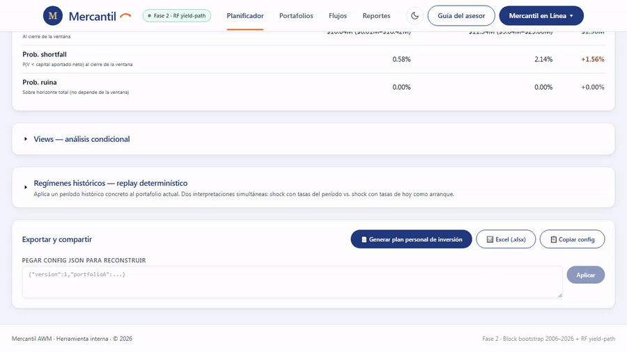

# Parte 4b — Seguimiento futuro

La conversación con el cliente no termina en la primera reunión. El plan se revisa periódicamente, y la herramienta sirve de soporte para esas revisiones igual que sirvió para la reunión inicial. Esta parte cubre cómo usarla en los seguimientos para mantener al cliente anclado al plan original sin caer en re-discusiones constantes.

> **Principio rector del seguimiento**: el plan no se rediseña en cada reunión. Se **monitorea contra la banda P10–P90 proyectada originalmente**, y sólo se re-discute cuando el capital efectivo cae fuera de esa banda o cuando la realidad del cliente cambia (ingresos, salud, objetivos, horizonte). El resto del tiempo, la conversación es de re-confirmación, no de re-decisión.

---

## Cadencia recomendada

La cadencia depende del bucket Wealth Way del cliente y de la fase del plan:

| Bucket / fase | Cadencia | Foco principal |
|---|---|---|
| Liquidez (0-5 años) | Semestral | Vigilar gastos no planificados y reactividad ante cambios de tasa corta. |
| Longevidad — fase de acumulación | Anual | Verificar que el capital efectivo esté dentro de la banda; recalibrar aportes si el cliente cambia ingresos. |
| Longevidad — fase de decumulación | Trimestral en el primer año, después semestral | El primer año es crítico por el *sequence-of-returns risk* — un mal mercado combinado con retiros agresivos puede dañar el plan irremediablemente. |
| Legado (multi-generacional, 30 años) | Anual con check breve cada semestre | Re-evaluación profunda cada 5 años o cuando hay cambio de fase (Carlos en la parte 5 es el ejemplo). |

Adicional a la cadencia base, **disparadores que adelantan una reunión**:

- Drawdown realizado por encima del 70% del max drawdown proyectado.
- Cambio material en los ingresos o gastos del cliente.
- Cambio en el horizonte (jubilación adelantada o postergada, expectativa de vida actualizada).
- Movimiento del régimen de mercado que active uno de los views que el cliente había marcado como preocupación.

---

## Estructura de una reunión de seguimiento

Cinco bloques en orden:

### 1. Recuperar la sesión anterior (3-5 min)

El asesor abre el PDF generado en la reunión previa. Lee al cliente el sessionId del documento (visible en la portada y en el footer de cada página) como ancla del histórico — es el mismo sessionId que aparece embebido en la metadata del PDF y permite rastrear la conversación específica que generó ese plan.

> **Importación drag-and-drop (en desarrollo)**: cuando esté disponible, el asesor arrastra el PDF de la sesión anterior sobre la herramienta y el state se rehidrata automáticamente — portafolios, reglas, ventana, parámetros. Mientras tanto, el flujo manual es: abrir el config JSON guardado por el asesor (ver Parte 3 paso 4.3) y pegarlo en el campo *"Pegar config JSON"* del ExportBar. Reconstruye la sesión exacta.

### 2. Verificar que el capital efectivo esté dentro de la banda proyectada (5-10 min)

El asesor pide al cliente el saldo actual de la cuenta. Compara contra la banda P10–P90 proyectada en la sesión inicial para el mes que corresponde al seguimiento.

Tres casos posibles:

- **Capital dentro de la banda (P10 a P90)** — el plan está en curso. Se sigue al siguiente bloque sin más conversación. *"Su plan está dentro del rango esperado. Vamos al día."*
- **Capital por encima de P90** — el mercado entregó un escenario favorable. Documentar y, si el cliente quiere, revisar si conviene re-balancear hacia un perfil un poco más conservador (*"capturamos un buen año, ahora podemos darnos el lujo de bajar el riesgo"*). Decisión opcional, no obligatoria.
- **Capital por debajo de P10** — el mercado entregó un escenario desfavorable. Activar la conversación de **replanificación, no de pánico**. El plan no falló — entró en la cola izquierda esperada. La pregunta es si seguir con el plan original (apostando a la reversión a la mediana) o ajustar (reducir retiros, aumentar aportes, extender horizonte).

> **Reglas honestas con el cliente**: que el capital esté por debajo de P10 ocurre en aproximadamente el 10% de los escenarios — no es una sorpresa metodológica. Lo que sí es importante: **no es señal de que el plan esté roto**, es señal de que el plan está siendo testeado por uno de los escenarios desfavorables que la herramienta ya había identificado. La decisión de ajustar o no se toma con la información completa, no con el pánico del momento.

### 3. Re-correr la simulación con capital remanente y horizonte restante (5-10 min)

El asesor toma:

- **Capital actual del cliente** (lo verificado en el bloque anterior, no el inicial del plan original).
- **Horizonte restante** del plan (horizonte original menos meses transcurridos).
- **Reglas de flujo** ajustadas a lo que efectivamente ha hecho el cliente — si pausó aportes, ajustar la regla; si retiró extra, registrarlo.

Click en Simular. La nueva corrida proyecta hacia adelante desde el estado actual.

**Lectura crítica**: comparar la **nueva probabilidad de ruina** (o la nueva banda P10–P90 del valor final) contra la **proyectada originalmente para el mismo horizonte de cierre**. Si la nueva probabilidad de ruina subió materialmente (por ejemplo, de 5% original a 20% actual), es señal de que el plan necesita ajuste. Si subió poco (de 5% a 7%), el plan tolera el camino transitado y no requiere acción.

**Plan original** (caso Marta inicial — capital USD 500.000, horizonte 25 años, retiro USD 4.000 mensuales reales, Conservador vs Balanceado):

**Reunión de seguimiento al año 5** (capital remanente USD 380.000, horizonte restante 20 años, mismas reglas de retiro):

La comparación entre ambos paneles permite responder: *¿la probabilidad de ruina subió materialmente respecto a la inicial? ¿El plan necesita ajuste o tolera el camino transitado?*

### 4. Re-correr los views activos en la sesión inicial (5-10 min)

Los views que se conversaron en la reunión inicial se vuelven a activar en el seguimiento. Dos lecturas:

- **¿La probabilidad del view subió o bajó?** — si subió materialmente (por ejemplo, *"Tasas suben 100 pbs"* pasó de 25% a 45%), es señal de que el régimen de mercado se está acercando al escenario de preocupación del cliente. Oportunidad para ajustar antes de que se materialice.
- **¿El view se materializó en el período transcurrido?** — comparar lo que efectivamente ocurrió en los meses entre reuniones contra los views que estaban activos. Si un view se materializó (por ejemplo, *"Portafolio A cae −20%"* sí ocurrió), repasar las consecuencias proyectadas vs las realizadas. Esto convierte la herramienta en un sistema de memoria para la relación: el cliente ve un asesor que documentó el pensamiento previo, no uno que racionaliza retrospectivamente.

> **Frase modelo al cliente**: *"En la reunión anterior conversamos este escenario [view X] y le mostré que su probabilidad estimada era del 20% y que, si ocurría, el impacto sobre el capital final sería de USD Y. Veamos: el escenario [se materializó / no se materializó] en estos meses. Y la probabilidad estimada para los próximos 12 meses cambió a Z%. Eso nos sugiere [seguir con el plan / hacer este ajuste]."*

### 5. Actualizar el PDF y cerrar la reunión

Al final del seguimiento, el asesor genera un **nuevo PDF de cierre**, idéntico en estructura al de la reunión inicial pero con los números actualizados. Mismo cliente, mismo bucket, fecha y sessionId nuevos. El cliente termina con dos PDFs en su archivo: el inicial y el del seguimiento. La diferencia entre ambos es su histórico documentado.

Si la decisión de la reunión fue *"seguir con el plan sin cambios"*, el PDF nuevo refleja eso explícitamente — la portada o la sección B (resumen ejecutivo) lleva la nota *"reunión de seguimiento — confirmado plan original"*.

Si hubo ajustes (cambio de portafolio, ajuste de retiro mensual, extensión de horizonte), el PDF nuevo refleja la configuración actualizada y se guarda con un sufijo de fecha o número de revisión en el nombre — por ejemplo, `pocho-longevity-2026-11.pdf`.

---

## Métricas que valen el seguimiento adicional

Hay tres métricas del panel de stats que cobran especial valor en seguimientos repetidos:

### Probabilidad de ruina recalculada

En clientes con retiros (Marta es el caso típico de la parte 5), la probabilidad de ruina **recalculada con capital remanente y horizonte restante** es el termómetro central. Se compara contra la probabilidad original. Si la nueva supera el doble de la original, hay señal de ajuste.

### Capital efectivo vs banda P10-P90 proyectada

Una métrica que el asesor calcula a mano comparando el saldo actual del cliente con la banda proyectada en la reunión inicial. La parte 5 tiene ejemplos concretos para Pablo y Marta.

### Probabilidad de los views activos

Re-evaluar la probabilidad de los views que el cliente había marcado como preocupación. Si las probabilidades suben con el tiempo, el régimen está moviéndose hacia los escenarios de stress.

---

## Cuándo el seguimiento dispara una replanificación

Tres umbrales prácticos:

1. **Capital efectivo por debajo de P10** durante dos seguimientos consecutivos.
2. **Probabilidad de ruina recalculada** por arriba del doble de la original (o por arriba del 25% absoluto, lo que sea más restrictivo).
3. **Cambio material en la realidad del cliente** — pérdida de empleo, enfermedad seria, cambio de objetivos, jubilación adelantada o postergada.

En cualquiera de los tres casos, la conversación deja de ser de seguimiento y se vuelve de **rediseño parcial del plan**. Las opciones típicas: ajustar el retiro mensual, extender el horizonte, cambiar el perfil de portafolio, agregar capital. El nuevo plan se documenta en un PDF nuevo y se anota explícitamente como *"replanificación post-evento [X]"*.

---

## Memoria de la relación asesor-cliente

Tras tres o cuatro seguimientos exitosos, el cliente acumula un histórico documentado de:

- Decisiones tomadas en cada reunión.
- Views que se conversaron y los que efectivamente se materializaron.
- Bandas proyectadas vs realización efectiva.
- Ajustes hechos al plan y por qué.

Ese histórico **es el activo más valioso de la relación con el cliente**. Cuando aparezca el primer mercado realmente difícil, el asesor no necesita improvisar — abre el PDF de la reunión anterior, le muestra al cliente la conversación que tuvieron sobre exactamente ese escenario, y la decisión documentada. La conversación pasa de *"qué hacemos ahora"* a *"recordemos qué decidimos cuando esto era todavía hipotético — sigamos con eso o ajustémoslo con cabeza fría"*.

> **Frase de cierre típica para una buena reunión de seguimiento**: *"Vamos al día. Su plan está dentro del rango que proyectamos. Los views que activamos en marzo siguen razonables. La próxima revisión queda para [fecha]. Si pasa cualquier cosa material antes — buena o mala — me llama y adelantamos."*

---

## Lista de assets pendientes para esta parte

| ID | Tipo | Descripción | Notas para grabar |
|---|---|---|---|
| 4b.1 | GIF (10 s) | Rehidratación manual desde JSON | Pegar config en textarea + click *Aplicar* + ver portafolios y plan restaurados. |
| 4b.2 | SCREENSHOT | Comparativo lado a lado de probabilidad de ruina (original vs recalculada) | Caso Marta al mes 60. Resaltar el delta. |
| 4b.3 | SCREENSHOT | Modal del PDF en seguimiento | Mismo cliente y bucket, carta personalizada *"seguimiento del plan inicial"*. |
| 4b.4 | SCREENSHOT (pendiente feature) | Drag-and-drop de PDF para rehidratar | A capturar cuando la feature esté implementada. |

Todos los GIFs en formato MP4 o GIF optimizado a < 2 MB cada uno.
